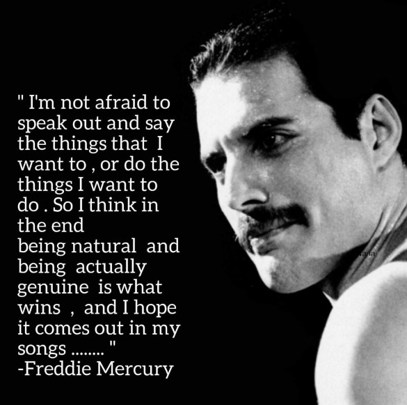

# Pablo Melero Alonso / **Arquitecto Empresarial IT** &nbsp;&nbsp;&nbsp;
<html>
 

</html>

#### ¿En qu&eacute; estoy trabajando ahora?
<html>

 
  
  

</html>

## ¿Quien soy?

Con **mas de 15 años de experiencia** en el sector de Tecnolog&iacute;as de la Informaci&oacute;n y Comunicaci&oacute;n (TIC), he desempeñado distintos roles dentro del ciclo de vida del **Desarrollo Software**; los cuales me han permitido adquirir una **visi&oacute;n 360°** sobre los servicios/productos que he gestionado y/o en los que he participado; acumulando una profunda experiencia en toda la vertical tecnol&oacute;gica de soluciones TIC.

Complet&eacute; mi formaci&oacute;n con un **M&aacute;ster en Direcci&oacute;n de Sistemas de Informaci&oacute;n y Comunicaci&oacute;n**, con la intenci&oacute;n de completar mi perfil profesional con habilidades de valor añadido; que complementando las adquiridas  me han permitido adquirir una **visi&oacute;n estrat&eacute;gica** en todo "reto" con el que me he encontrado.

Acostumbrado a trabajar en **entornos multidisciplinares** y de **constante cambio**, me considero:

* **Una persona curiosa** y con gran inquietud por adquirir nuevos conocimientos, especialmente he de reconocer que **tecnol&oacute;gicos**. A lo largo de estos &uacute;ltimos años, de una manera proactiva,  he ido adquiriendo distintas habilidades y conocimiento mediante cursos de formaci&oacute;n; los cuales me han permitido alcanzar los objetivos profesionales con los que me encontrado de manera solvente.

* **Apasionado por el trabajo en equipo**. Acostumbrado a trabajar en entornos multidisciplinares, me considero una persona completamente capacitada para tratar cuestiones y/o problemas a cualquier nivel.

## ¿Cual es el objetivo de este espacio?

> - :wink: Compartir **utilidades** de mi d&iacute;a a d&iacute;a, las cuales entiendo que ayudarán a todo aquel "curioso" como yo.
> - :innocent: Compartir **experiencias** adquiridas, que no seamos siempre los que "*tropezamos dos (e incluso más veces) con la misma piedra*".
> - :scream: Compartir **inquietudes** existenciales !   
>  *No tengo miedo de hablar y decir las cosas que quiero, o hacer las cosas que quiero. As&iacute; que creo que al final ser natural y ser realmente genuino es lo que gana, y espero que salga en mi "code"*
  - Pablo Melero Alonso  

## Cont&aacute;ctame

Si quieres conocer mas de m&iacute; te dejo un par de  enlaces; estar&eacute; encantado de atenderte para poder conocernos y compartir inquietudes y oportunidades!

&nbsp;<a href="https://www.linkedin.com/in/pmeleroalonso">LinkedIn</a></img>&nbsp;&nbsp;&nbsp;
&nbsp;<a href="mailto:p.melero.alonso@gmail.com">GMail</a></img>

